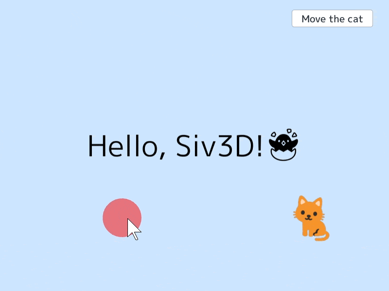

# Siv3D: C++ Library for Creative Coding



```C++
# include <Siv3D.hpp>

void Main()
{
	// Set background color to sky blue
	Scene::SetBackground(ColorF(0.8, 0.9, 1.0));

	// Create a new font
	const Font font(60);

	// Create a new texture that contains a cat emoji
	const Texture cat(Emoji(U"🐈"));

	// Coordinates of the cat
	Vec2 catPos(640, 450);

	while (System::Update())
	{
		// Put a message in the middle of the screen
		font(U"Hello, Siv3D!🐣").drawAt(Scene::Center(), Palette::Black);

		// Display the texture with animated size
		cat.resized(100 + Periodic::Sine0_1(1s) * 20).drawAt(catPos);

		// Draw a translucent red circle that follows the mouse cursor
		Circle(Cursor::Pos(), 40).draw(ColorF(1, 0, 0, 0.5));

		// When [A] key is down
		if (KeyA.down())
		{
			// Print `Hello!`
			Print << U"Hello!";
		}

		// When [Move the cat] button is pushed
		if (SimpleGUI::Button(U"Move the cat", Vec2(600, 20)))
		{
			// Move the cat's coordinates to a random position in the screen
			catPos = RandomVec2(Scene::Rect());
		}
	}
}
```

# Getting started
## Requirements
### Windows
- Windows 7 SP1 / 8.1 / 10 (64-bit)
- **Visual Studio 2019 version 16.3**
    - Install **Desktop development with C++** from the Visual Studio Installer

### macOS
- macOS High Sierra v10.13 or newer
- Xcode 10.1 or newer

### Linux
Linux users must build OpenSiv3D from source. See [Linux/README](https://github.com/Siv3D/OpenSiv3D/blob/master/Linux/README.md) for further information.

## Installing OpenSiv3D SDK v0.4.2
### Windows
1. Download **[OpenSiv3D Installer for Windows Desktop](https://siv3d.jp/downloads/Siv3D/OpenSiv3D(0.4.2)Installer.exe)** and run the installer.

!!! note
    Use the Control Panel to uninstall OpenSiv3D SDK.

### macOS
1. Download **[OpenSiv3D Project Templates for macOS](https://siv3d.jp/downloads/Siv3D/siv3d_v0.4.2_macOS.zip)** and extract its contents.
2. (for macOS Catalina users) Move the SDK folder into `User/Applications` folder to prevent a file access permissions dialog from being displayed when a Xcode project is executed. Some folders such as `User/Desktop` and `User/Downloads` require extra access permission.

## Building an OpenSiv3D Application
### Windows
1. Lanuch Visual Studio 2019 and open a **New Project Dialog** by clicking **Create a new project**.
2. Select **OpenSiv3D(X.X.X)** project and then click **Next**.
3. Type a name for the project.
4. Click **OK** to create the project.
5. On the **Build** menu, click **Build Solution**.
6. On the **Debug** menu, click **Start Debugging**.

### macOS
1. Open the project file (siv3d_vX.X.X_macOS/examples/empty/empty.xcodeproj) in Xcode.
2. Click **Run button ▶️** to build and run the application.
3. (for macOS Catalina users) A file access permissions dialog can be inactivated by placing the project folder under `User/Applications` folder.

## 💗 [Sponsors](https://github.com/sponsors/Reputeless)
- [sknjpn](https://twitter.com/sknjpn)
- アゲハマ
- chobby75
- papparappara
- (anonymous 😀)
- minachun