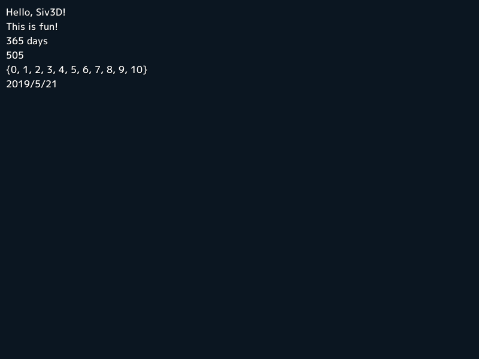
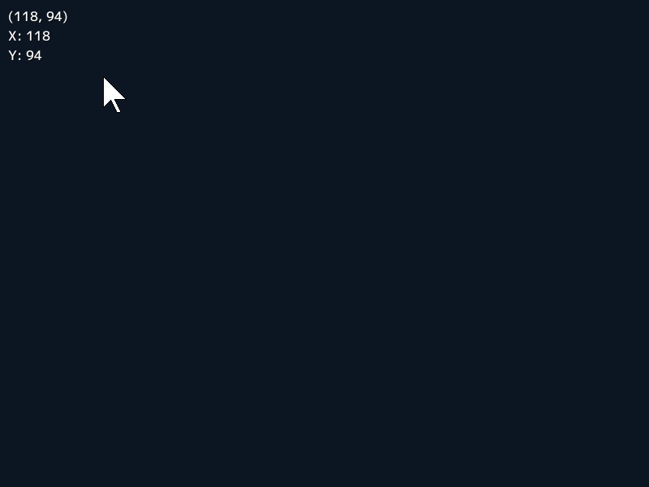
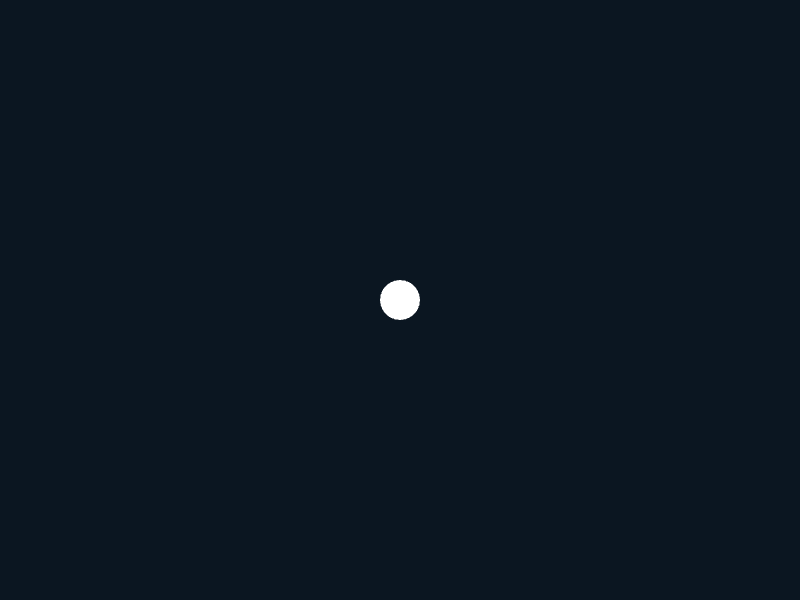

# チュートリアル
## 1. Siv3D の基本
### 1.1 インクルードするヘッダ

Siv3D のプログラムを書くときは、いつも `<Siv3D.hpp>` ヘッダをインクルードします。
```C++
# include <Siv3D.hpp>
```

これだけで、Siv3D のほぼすべての機能を使ってプログラムを書けるようになります。  
「ほぼ」というのは、マクロを定義することで利用可能になる上級者向けのいくつかの機能や、実験的な機能を提供するおまけのヘッダがあるためです。今はまだ説明しません。

C++ のプログラマなら、ほかにも `<iostream>` や `<vector>` などの C++ 標準ライブラリをインクルードしたくなるかもしれませんが、その必要はありません。すでに `<Siv3D.hpp>` の中で、Siv3D のプログラミングでよく使われる主要な C++ 標準ライブラリがインクルードされているためです。また、標準ライブラリの機能の多くが、より便利な Siv3D の関数やクラスで再実装されているので、Siv3D の学習の序盤で C++ 標準ライブラリの関数を使うことはめったにありません。

!!! 文法
    `# include <???>` または `# include "???"` で、ヘッダ `???` をインクルードします。前者の書き方では、標準ライブラリや、プロジェクトの設定でインクルードパスに設定されているフォルダのファイルが対象になり、後者では相対パスまたは絶対パスでファイルを検索します。Siv3D のプロジェクトでは、Siv3D のヘッダがあるディレクトリがインクルードパスに設定されていて、`# include <Siv3D.hpp>` で Siv3D のヘッダをインクルードできます。Siv3D 以外のプロジェクトで同じように書いても `Siv3D.hpp` を見つけられずコンパイルエラーになります。

### 1.2 エントリーポイント
通常、C++ のエントリーポイントは `int main()` です。しかし、Siv3D ではこの `main()` 関数は Siv3D エンジンによって実装されていて、次のようにユーザの見えないところで、ウィンドウやグラフィックスの初期化処理を行うプログラムがすでに用意されています。
```
// 説明のための疑似コード
int main()
{
    Siv3D の初期化...

    Main(); // この関数をユーザがプログラムする

    Siv3D の終了処理...
}
```
ユーザが実装するプログラムは、このプログラムの `void Main()` 関数です。

事前に初期化処理が完了しているので、`Main` 関数の中でいきなり Siv3D の機能を使うことができますし、`Main` 関数の実行が終了したら、ロードしたアセットやウィンドウの後片付けを Siv3D が自動的に行ってくれます。

### 1.3 最小のプログラム

ここまでの話を踏まえて、これが Siv3D の最小のプログラムです。
```C++
# include <Siv3D.hpp>

void Main()
{

}
```
ここでの `Main` 関数はすぐに終了してしまうので、このプログラムを実行しても、ほとんど何も反応が無いように見えるでしょう。

!!! 文法
    これは関数を定義するプログラムです。`Main` は関数の名前を、`void` はこの関数が結果の値を返さないことを表します。`{ }` 内には、この関数で実行したいプログラムを上から順に記述します。途中で `return` するか、終端までたどり着くと関数の実行は終了します。

### 1.4 メインループとウィンドウ

プログラムがすぐに終了してしまっては、ユーザとインタラクションするようなアプリケーションが作れません。`Main` 関数がずっと続くように **メインループ** を実装しましょう。次のプログラムを実行するとウィンドウが表示されます。
```C++ hl_lines="5 6 7 8"
# include <Siv3D.hpp>

void Main()
{
    while (System::Update())
    {

    }
}
```
新しく加えた行は `while` 文によってくり返し実行され、プログラムが半永久的に続くようになります。くり返しのたびに `System::Update` 関数がウィンドウの表示や音楽の再生、マウスやキーボードの入力情報などを更新するので、グラフィックスの表示やユーザとのやり取りをプログラムできるようになります。

!!! 文法
    `while()` 文は、`( )` 内の条件が真 (true) の間、`{ }` で囲まれた部分をくり返し実行します。

`System::Update` は普段は `true` を返しますが、ウィンドウが閉じられたり、エスケープキーが押されたりするなど、アプリケーションを終了させる特別な **ユーザアクション** が実行されると、以降はずっと `false` を返すようになります。 アプリケーションはこの状態になったら速やかにメインループから抜け、`Main` 関数を終了させる必要があります。といっても、上記のプログラムのように書いていれば、自然にこの通りに動作するので心配はありません。

!!! Info
    デフォルトでは「ウィンドウを閉じる」「エスケープキーを押す」「`System::Exit` 関数を呼ぶ」の 3 つが、アプリケーションを終了させるためのユーザアクションとして設定されています。この設定は`System::SetTerminationTriggers` 関数に `UserAction` フラグの組み合わせを渡すことでカスタマイズできます。

!!! Info
    メインループは、使用しているモニターのリフレッシュレートと同じ速度で繰り返されます（通常は毎秒 60, 120, または 144 フレーム）。`Graphics::SetTargetFrameRateHz` 関数に値を渡すことで、この上限を解除できます。

### 1.5 Hello, Siv3D!
画面にメッセージを表示してみましょう。Siv3D でテキストや数値を簡単に画面に表示するには、デバッグ表示のための機能 `Print` を使うと便利です。

```C++ hl_lines="5"
# include <Siv3D.hpp>

void Main()
{
	Print << U"Hello, Siv3D!";

	while (System::Update())
	{
		
	}
}
```
`Print` に向かって、出力の記号 `<<` でテキストを送ると、そのテキストが画面に表示されます。


!!! 文法
    テキストをプログラムに登場させるときは `" "` で囲みます。Siv3D ではさらに、日本語を扱いやすい UTF-32 という形式でテキストデータを扱うため、`"` の先頭には `U` というプレフィックスを付けます。

### 1.6 もっと Print
`Print` に送れるのは 1 つのテキストだけではありません。数値や配列、日付なども送ってみましょう。


```C++ hl_lines="7 8 9 10 11 12 13 14 15"
# include <Siv3D.hpp>

void Main()
{
	Print << U"Hello, Siv3D!";

    Print << U"This is fun!";

    Print << 365 << U" days";

    Print << 100 * 5 + 5;

    Print << Range(0, 10);

    Print << Date::Today();

	while (System::Update())
	{
		
	}
}
```



### 1.7 Print したものを消す
`Print` した内容は蓄積されるので、次のように `Print` をメインループの中で使うと、毎フレーム新しいメッセージが追加されて、古いメッセージを画面の外に追いやります。画面からあふれたメッセージは自動的に消えるので、`Print` のし過ぎを心配する必要はありません。

```C++
# include <Siv3D.hpp>

void Main()
{
	int32 count = 0;

	while (System::Update())
	{
		Print << count;

		++count;
	}
}
```


メッセージが画面外に消えるのを待たずに、プログラムを使って消去したいときには `ClearPrint` 関数を使います。プログラムのメインループの先頭で `ClearPrint` すると、その時点で蓄積されていたメッセージが全部消去され、つねに最新の `Print` した内容だけが表示されるようになります。

```C++ hl_lines="9"
# include <Siv3D.hpp>

void Main()
{
	int32 count = 0;

	while (System::Update())
	{
		ClearPrint(); // Print したメッセージを消去

		Print << count;

		++count;
	}
}
```

!!! Info
    Siv3D で整数を扱うときは、`int` や `unsigned long long` のような標準の型名の代わりに、`int32` や `uint64` のようにサイズを明示的に示した型名を使います。これらの型名を使うことで、プラットフォーム間での移植性が高まり、一貫性のある読みやすいコードになります。

### 1.8 画面の座標系

ウィンドウ内の黒い部分が **画面** で、Siv3D はこの領域に文字や図形、画像を表示できます。
画面のサイズは、基本の状態では **幅 800 ピクセル、高さ 600 ピクセル** です。画面上の位置を表す座標系は、一番左上のピクセルを「X 座標 0」「Y 座標 0」を表す `(0, 0)` と表記し、右に進むと X 座標が大きく、下に進むと Y 座標が大きくなります。画面の一番右下のピクセルの座標は `(799, 599)` です。 

`Cursor::Pos` 関数を使うと、現在のマウスカーソルの座標を `Point` 型で取得できます。`Point` 型の値は X 座標を表す `int32 x` と Y 座標を表す `int32 y` の 2 つの要素を持っていますが、そのまま丸ごと `Print` に送って表示することもできます。

```C++ hl_lines="9 10 11 12 13"
# include <Siv3D.hpp>

void Main()
{
	while (System::Update())
	{
		ClearPrint();

		Print << Cursor::Pos(); // 現在のマウスカーソル座標を表示

		Print << U"X: " << Cursor::Pos().x; // X 座標だけを表示

		Print << U"Y: " << Cursor::Pos().y; // Y 座標だけを表示
	}
}
```



## 2. 図形を描く

### 2.1 円を描く
画面に図形を描く方法を学びましょう。Siv3D では、図形オブジェクトを作成し、その `draw()` メンバ関数を呼んで描画を行うのが基本的なやり方です。円を描くときは `Circle` を作成し、その `draw()` を呼びます。

```C++ hl_lines="8"
# include <Siv3D.hpp>

void Main()
{
	while (System::Update())
	{
		// 中心座標 (400, 300), 半径 20 の円を描く
		Circle(400, 300, 20).draw();
	}
}
```



`Circle()` の最後に指定するパラメータは円の半径です。この値を大きくすれば、描画される円も大きくなります。

```C++ hl_lines="8"
# include <Siv3D.hpp>

void Main()
{
	while (System::Update())
	{
		// 中心座標 (400, 300), 半径 100 の円を描く
		Circle(400, 300, 100).draw();
	}
}
```


円がマウスカーソルの座標に連動して動くようにしてみましょう。`Circle()` の最初に指定するパラメータは円の中心の X 座標です。この値をマウスカーソルの X 座標にしてみます。

```C++ hl_lines="7"
# include <Siv3D.hpp>

void Main()
{
	while (System::Update())
	{
		Circle(Cursor::Pos().x, 300, 100).draw();
	}
}
```


マウスカーソルに追従して、円が左右に動くようになりました。

今度は Y 座標もマウスカーソルと連動するようにしてみます。

```C++ hl_lines="7"
# include <Siv3D.hpp>

void Main()
{
	while (System::Update())
	{
		Circle(Cursor::Pos().x, Cursor::Pos().y, 100).draw();
	}
}
```


Siv3D で X 座標、Y 座標 2 つの値を受け取る関数は、多くの場合、1 つの Point 型を受け取る別バージョンの関数（オーバーロード）を提供しているケースがよくあります。`Circle` も、「X 座標」「Y 座標」「半径」の 3 つの引数ではなく、「中心座標 (`Point` 型)」「半径」の 2 つの引数を受け取るオーバーロードがあります。これを使うと、先ほど同じはたらきをするコードを短く書けます。

```C++ hl_lines="7"
# include <Siv3D.hpp>

void Main()
{
	while (System::Update())
	{
		Circle(Cursor::Pos(), 100).draw();
	}
}
```

### 2.2 長方形を描く
長方形を描くときは `Rect` を作成し、その `draw()` を呼びます。


