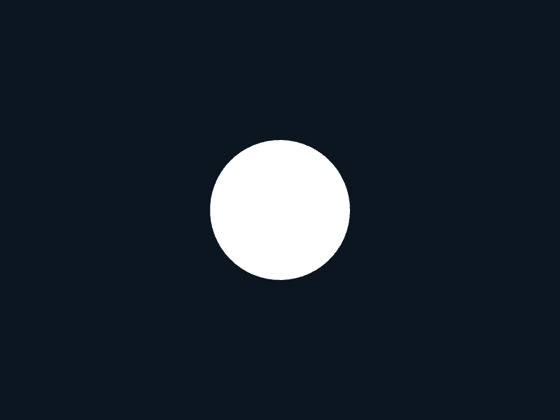
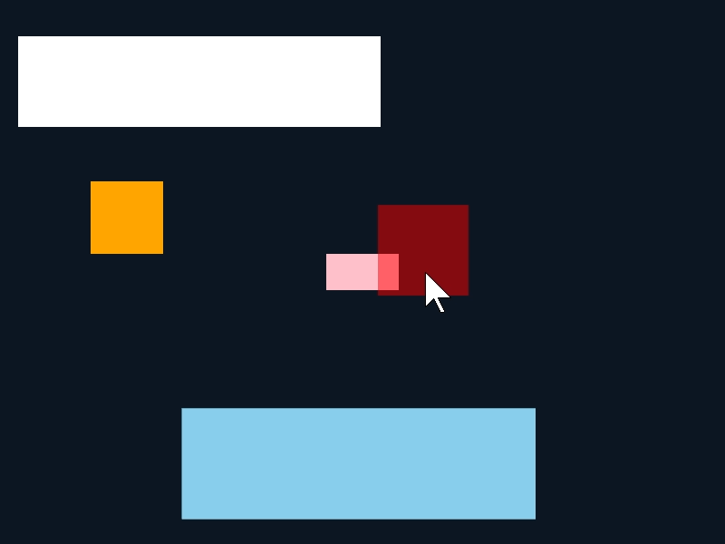

# 2. 図形を描く

## 2.1 円を描く
画面に図形を描く方法を学びましょう。Siv3D では、図形オブジェクトを作成し、その `draw()` メンバ関数を呼んで描画を行うのが基本的なやり方です。円を描くときは `Circle` を作成し、その `draw()` を呼びます。

```C++ hl_lines="8"
# include <Siv3D.hpp>

void Main()
{
	while (System::Update())
	{
		// 中心座標 (400, 300), 半径 20 の円を描く
		Circle(400, 300, 20).draw();
	}
}
```


`Circle()` の最後に指定するパラメータは円の半径です。この値を大きくすれば、描画される円も大きくなります。

```C++ hl_lines="8"
# include <Siv3D.hpp>

void Main()
{
	while (System::Update())
	{
		// 中心座標 (400, 300), 半径 100 の円を描く
		Circle(400, 300, 100).draw();
	}
}
```




円がマウスカーソルの座標に連動して動くようにしてみましょう。`Circle()` の最初に指定するパラメータは円の中心の X 座標です。この値をマウスカーソルの X 座標にしてみます。

```C++ hl_lines="7"
# include <Siv3D.hpp>

void Main()
{
	while (System::Update())
	{
		Circle(Cursor::Pos().x, 300, 100).draw();
	}
}
```


マウスカーソルに追従して、円が左右に動くようになりました。

!!! Info
    `Print` で表示したメッセージはいつまでも画面に残りましたが、Siv3D では `Print` 以外のすべての描画内容は `System::Update` のたびに背景の色でリセットされます。

今度は Y 座標もマウスカーソルと連動するようにしてみます。

```C++ hl_lines="7"
# include <Siv3D.hpp>

void Main()
{
	while (System::Update())
	{
		Circle(Cursor::Pos().x, Cursor::Pos().y, 100).draw();
	}
}
```


Siv3D で X 座標、Y 座標 2 つの値を受け取る関数は、多くの場合、1 つの Point 型を受け取る別バージョンの関数（オーバーロード）を提供しているケースがよくあります。`Circle` も、「X 座標」「Y 座標」「半径」の 3 つの引数ではなく、「中心座標 (`Point` 型)」「半径」の 2 つの引数を受け取るオーバーロードがあります。これを使うと、先ほど同じはたらきをするコードを短く書けます。

```C++ hl_lines="7"
# include <Siv3D.hpp>

void Main()
{
	while (System::Update())
	{
		Circle(Cursor::Pos(), 100).draw();
	}
}
```

## 2.2 色を付ける
図形に色を付けたいときは `draw()` 関数に色を渡します。色の指定の方法は大きく 4 通りあります。

| 色の表現               | 値の範囲                                                                                                  |
|--------------------|-------------------------------------------------------------------------------------------------------|
| Palette::色名        | [Web カラー :fa-external-link:](https://ironodata.info/colorscheme/colorname.html) の名前で色を指定                                                                                       |
| ColorF(r, g, b, a) | 0.0 - 1.0 の範囲で RGBA の各成分を指定                                                                           |
| Color(r, g, b, a)  | 0 - 255 の整数の範囲で RGBA の各成分を指定                                                                          |
| HSV(h, s, v, a)    | 色相 `h`, 彩度 `s`, 明度 `v` とアルファ値 `a` の各成分を指定。<br>h は 0.0 - 360.0 (370.0 は 10.0 と同じ). s, v, a は 0.0 - 1.0,の範囲 |

**Palette::色名** は RGB 値を覚えていなくても使える色の表現です。

**ColorF** は Siv3D で一番使い勝手が良い色の表現形式です。

**Color** は `Image` 型の要素で、Siv3D で画像処理をするときに使われる形式です。

**HSV** は赤っぽい、青っぽいなど色の種類を表す色相 (hue) と、色の鮮やかを表す彩度 (saturation), 色の明るさを表す明度 (value) の 3 要素を使った HSV 色空間で色を表現します。

`ColorF`, `Color`, `HSV` はいずれも **アルファ値** `a` を持ちます。アルファ値は「不透明度」を表し、最大値 (`ColorF`, `HSV` の場合 1.0, `Color` の場合 255) ではまったく透過しませんが、値を小さくするとそれに応じて背景を透過する半透明になり、0 になると完全に透明になります。

色の指定はプログラムでよく使われるので、次のような短い書き方も用意されています。例えば `ColorF(0.5)` は `ColorF(0.5, 0.5, 0.5, 1.0)` と同等です。

| 短い書き方           | 意味                         |
|-----------------|----------------------------|
| `ColorF(r, g, b)` | `ColorF(r, g, b, 1.0)`       |
| `ColorF(rgb, a)`  | `ColorF(rgb, rgb, rgb, a)`   |
| `ColorF(rgb)`     | `ColorF(rgb, rgb, rgb, 1.0)` |
| `Color(r, g, b)`  | `Color(r, g, b, 255)`        |
| `Color(rgb, a)`   | `Color(rgb, rgb, rgb, a)`    |
| `Color(rgb)`      | `Color(rgb, rgb, rgb, 255)`  |
| `HSV(h, s, v)`    | `HSV(h, s, v, 1.0)`          |
| `HSV(h, a)`       | `HSV(h, 1.0, 1.0, a)`        |
| `HSV(h)`          | `HSV(h, 1.0, 1.0, 1.0)`      |

色の付いたいくつかの円を描いてみましょう。`draw()` に色を指定しなかった場合の図形の色は `Palette::White` (`ColorF(1.0, 1.0, 1.0, 1.0)`) になります。

```C++
# include <Siv3D.hpp>

void Main()
{
	while (System::Update())
	{
		// 左から順に 7 つの円を描く
		Circle(100, 200, 40).draw();

		Circle(200, 200, 40).draw(Palette::Green);

		Circle(300, 200, 40).draw(Palette::Skyblue);

		Circle(400, 200, 40).draw(ColorF(1.0, 0.8, 0.0));

		Circle(500, 200, 40).draw(Color(255, 127, 127));

		Circle(600, 200, 40).draw(HSV(160.0, 1.0, 1.0));

		Circle(700, 200, 40).draw(HSV(160.0, 0.75, 1.0));

		// 半透明の円
		Circle(Cursor::Pos(), 80).draw(ColorF(0.0, 0.5, 1.0, 0.8));
	}
}
```


## 2.3 背景の色を変える
背景の色を変えるには `Scene::SetBackground` 関数に色を渡します。新しい背景色は、次の `System::Update` で画面の描画内容をリセットするときから反映されます。背景色は一度設定すると、再度変更されるまで同じ設定が使われます。

```C++ hl_lines="5"
# include <Siv3D.hpp>

void Main()
{
	Scene::SetBackground(ColorF(0.3, 0.6, 1.0));

	while (System::Update())
	{
		Circle(Cursor::Pos(), 80).draw();
	}
}
```


背景色の変更にコストはかからないので、背景色は毎フレーム変更しても大丈夫です。プログラムの経過時間（秒）を `Scene::Time` で取得して、時間に応じて背景色の色相を変化させてみましょう。

```C++
# include <Siv3D.hpp>

void Main()
{
	while (System::Update())
	{
		const double hue = Scene::Time() * 60.0;

		Scene::SetBackground(HSV(hue, 0.6, 1.0));
	}
}
```


## 2.4 長方形を描く
長方形を描くときは `Rect` を作成し、`draw()` を呼びます。

```C++
# include <Siv3D.hpp>

void Main()
{
	while (System::Update())
	{
		// 座標 (20, 40) を左上の基準位置にして、幅 400, 高さ 100 の長方形を描く 
		Rect(20, 40, 400, 100).draw();

		// 座標 (20, 40) を左上の基準位置にして、幅が 80 の正方形を描く 
		Rect(100, 200, 80).draw(Palette::Orange);

		// 座標 (400, 300) を中心の基準位置にして、幅 80, 高さ 40 の長方形を描く
		Rect(Arg::center(400, 300), 80, 40).draw(Palette::Pink);

		// マウスカーソルの座標を中心の基準位置にして、幅が 100 の正方形を描く 
		Rect(Arg::center(Cursor::Pos()), 100).draw(ColorF(1.0, 0.0, 0.0, 0.5));

		// 座標や大きさを浮動小数点数 (小数を含む数）で指定したい場合は RectF
		RectF(200.4, 450.3, 390.5, 122.5).draw(Palette::Skyblue);
	}
}
```



図形は `draw()` した順番に描画されます。このプログラムでは、マウスカーソルに追従する赤い正方形よりも、画面の下にある水色の大きな長方形が上に来ます。

`Rect` 型は左上の座標と幅、高さをそれぞれ `int32 x`, `int32 y`, `int32 w`, `int32 h` というメンバ変数で表します。整数ではなく浮動小数点数で扱いたい場合は、すべての要素が `double` 型である `RectF` を使います。

## 2.5 枠を描く
図形は、`draw()` の代わりに `drawFrame()` することで、枠だけを描けます。
